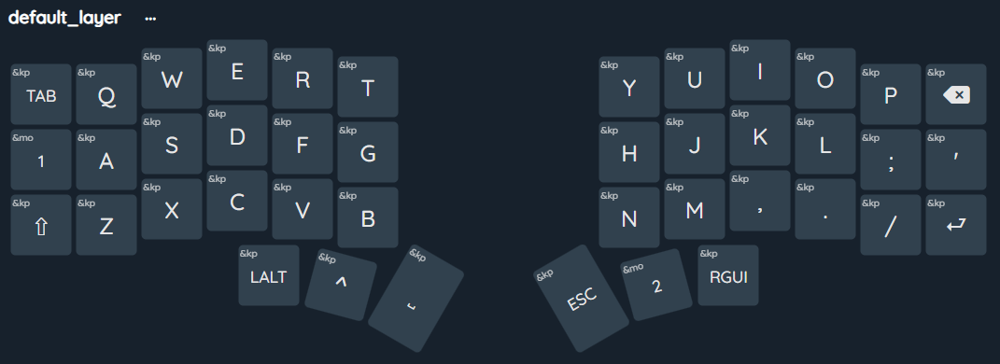
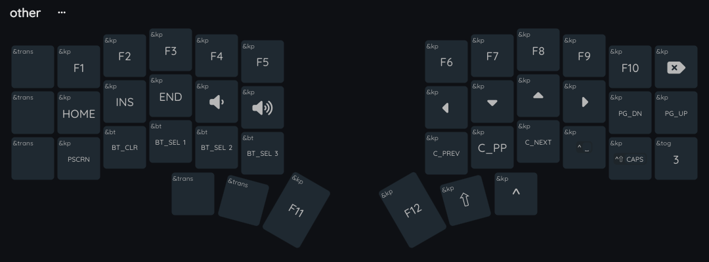
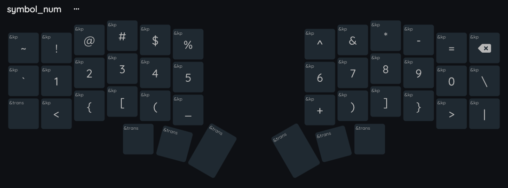

## Wireless Corne ZMK config

---

- Nice!Nano2 controller
- Nice!View  OLED display

## Layers:

---

[Keymap editor link](https://nickcoutsos.github.io/keymap-editor/)

## OLED:

---

- Layer Status
- Battery Status *(icon)*
- ~~WPM~~
- Output *(Current connection USB/BLE)*
